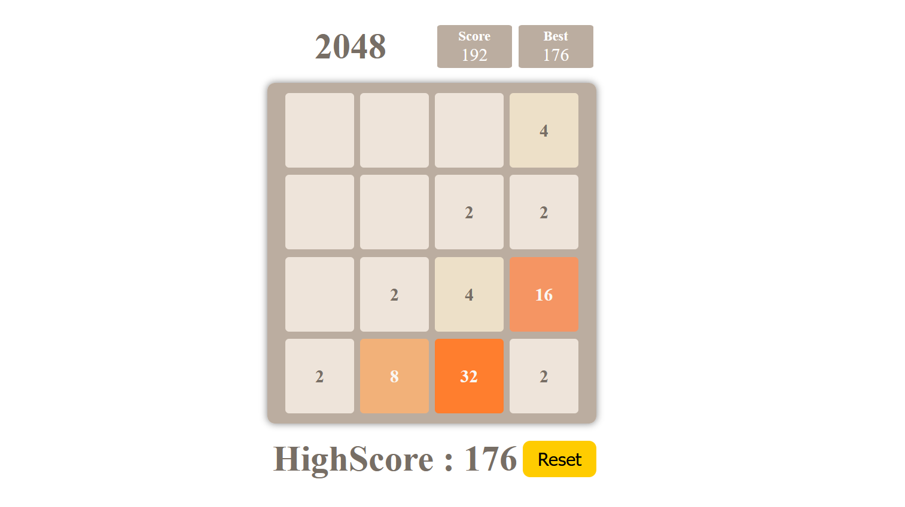

# 2048 Game

Welcome to **2048**, a web-based clone of the popular sliding puzzle game built with **React**, **Vite**, and **TypeScript**.

## Table of Contents

- [Demo](#demo)
- [Features](#features)
- [Technologies](#technologies)
- [Installation](#installation)
- [Usage](#usage)
- [Screenshots](#screenshots)
- [How to Play](#how-to-play)
- [Contributing](#contributing)

## Demo

Check out the live demo of the 2048 game [here](https://manohar-penta.github.io/2048/).

## Features

- Keyboard and touch support
- Keeps track of high scores
- Simple and intuitive design

## Technologies

- **Frontend Framework**: React (with Vite)
- **Language**: TypeScript
- **Styling**: CSS
- **Build Tool**: Vite

## Installation

1. Clone the repository:

   ```bash
   git clone https://github.com/yourusername/2048-game.git
   ```

2. Navigate to the project directory:

   ```bash
   cd 2048-game
   ```

3. Install dependencies:

   ```bash
   pnpm install
   ```

## Usage

To start the development server, run:

```bash
pnpm run dev
```

The app will be available at `http://localhost:5173`.

To create a production build, run:

```bash
pnpm run build
```

## Screenshots

Here are some screenshots from the game:

### Game Board



### Game Over


## How to Play

The goal of the game is to slide numbered tiles on a grid to combine them and create a tile with the number 2048.

- **Controls**: Use the arrow keys (or swipe on mobile devices) to slide the tiles.
- **Combine Tiles**: When two tiles with the same number collide, they merge into one.
- **Win Condition**: You win when you create a 2048 tile.
- **Lose Condition**: The game ends when no more moves are possible.

## Contributing

Contributions are welcome! If you'd like to make improvements, please:

1. Fork the project.
2. Create a new feature branch (`git checkout -b feature/my-feature`).
3. Commit your changes (`git commit -m 'Add my feature'`).
4. Push to the branch (`git push origin feature/my-feature`).
5. Open a pull request.
